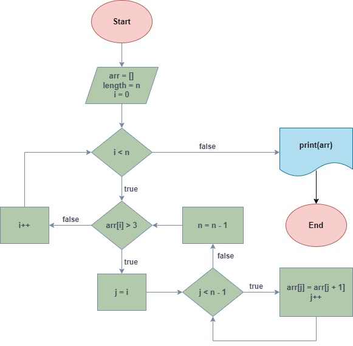

## Название проекта

**Итоговая контрольная работа**

## Цель

**Промежуточная аттестация**

## Задание

Написать программу, которая из имеющегося массива строк формирует новый массив из строк, длина которых меньше, либо равна 3 символам. Первоначальный массив можно ввести с клавиатуры, либо задать на старте выполнения алгоритма. При решении не рекомендуется пользоваться коллекциями, лучше обойтись исключительно массивами.

Примеры:

- [“Hello”, “2”, “world”, “:-)”] → [“2”, “:-)”]
- [“1234”, “1567”, “-2”, “computer science”] → [“-2”]
- [“Russia”, “Denmark”, “Kazan”] → []

## План выполнения

1. Создать репозиторий на GitHub.
2. Нарисовать блок-схему алгоритма.
3. Снабдить репозиторий оформленным текстовым описанием решения (файл README.md).
4. Написать программу, решающую поставленную задачу.
5. Использовать контроль версий в работе над этим небольшим проектом.

## Краткое описание решения

1. Создаем репозиторий на GitHub. Создаем новый проект и связываем его с удаленным репозиторием.

   - [Ссылка на репозиторий](https://github.com/eyerie117/Final_test.git)

2. Создаем блок-схему решения задачи (block_daigram.jpeg), добавляем в проект.

   - 

3. Решаем задачу на основании созданного алгоритма:

   - Элементы массива вводятся пользователем последовательно и разделяются пробелом. Введенные элементы преобразуются в массив строк.

   - **Создаем метод ReleaseArray для перебора заданного пользователем массива:**

     1. Метод ReleaseArray последовательно проверяет длину каждого элемента в соответствии с условием.
     2. Если длина элемента превышает 3 символа, данный элемент перемещается в конец массива, а все остальные сдвигаются на один элемент влево, после чего с помощью функции Array.Resize длина массива уменьшается на один элемент. Таким образом, данный элемент удален из массива.
     3. Снова переходим к первому элементу. Если его длина превышает 3 символа, повторяется пункт 2 (см. выше).
     4. Если длина элемента соответствует условию (3 символа и меньше), то элемент остается на месте, а индекс текущего элемента увеличивается на единицу.
     5. Таким образом, после завершения цикла в массиве остаются только элементы, длина которых не превышает три символа.
     6. Полученный массив выводится на экран.

   - Проверяем работу метода и корректность вывода решения, сохраняем в репозиторий.

4. Создаем краткое описание проекта (README.md) и добавляем в репозиторий.

## Автор проекта

Ксения Есепенко

GeekBrains

факультет: Разработчик

## Дата

26.11.2023
